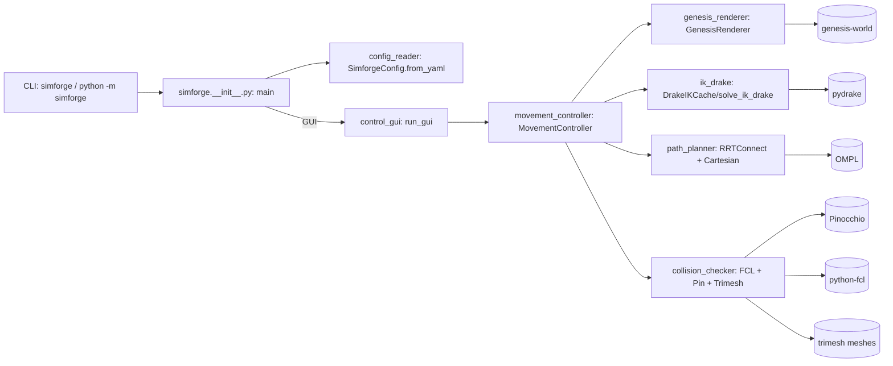
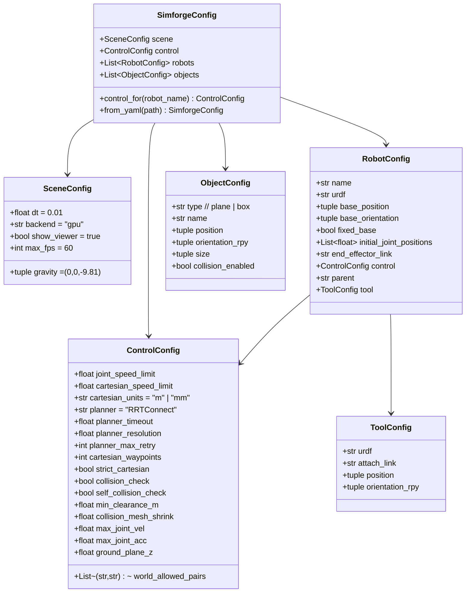
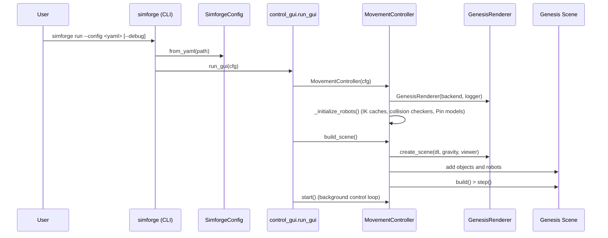
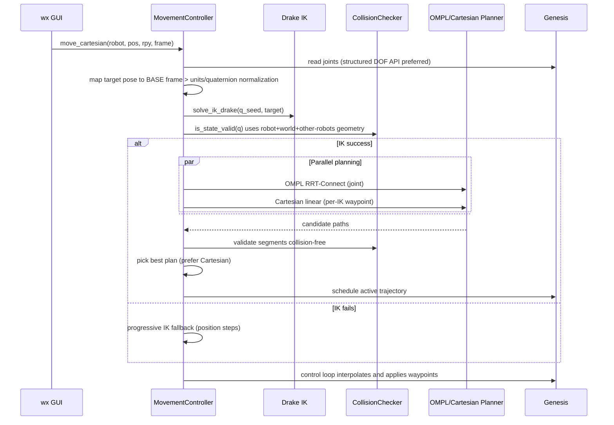

# Simforge Architecture

This document explains the architecture of the Simforge package: key modules, data flow, external dependencies, configuration model, and the main execution paths. It also provides sequence and component diagrams to give a precise mental model for extending or debugging the system.

## High-level overview

Simforge is a Genesis-powered robot simulator with both joint-space and Cartesian control:

- Rendering/simulation: `genesis-world` (wrapped by `GenesisRenderer`)
- Inverse kinematics: Drake (`pydrake`)
- Motion planning: OMPL (RRT-Connect) and a Cartesian straight-line planner
- Collision checking: Pinocchio + python-fcl + trimesh
- GUI: wxPython (optional)
- Configuration: YAML loaded into Pydantic models



## Core modules and responsibilities

- `simforge/__init__.py`
  - CLI entrypoint (`simforge`): `init` to copy config templates; `run` to start GUI+sim.
  - Signal handling and graceful shutdown via `atexit`.

- `simforge/__main__.py`
  - Allows `python -m simforge` by delegating to `main()` in `__init__.py`.

- `simforge/config_reader.py`
  - Pydantic models for YAML configuration: `SimforgeConfig`, `SceneConfig`, `ControlConfig`, `RobotConfig`, `ToolConfig`, `ObjectConfig`.
  - YAML loader with merging logic for `defaults.control` → global `control` → `robot.control`.
  - Supports `robots:` entries that include external YAML files by string path.
  - Maps `pose: {position, rpy}` to `base_position`, `base_orientation`.

- `simforge/genesis_renderer.py`
  - Thin, testable wrapper around Genesis init and scene creation.
  - `create_scene()` returns a `gs.Scene` with sim and viewer options.

- `simforge/ik_drake.py`
  - `DrakeIKCache`: builds and caches a `MultibodyPlant` per robot URDF; resolves base and EE frames; extracts joint limits and mid-ranges.
  - `solve_ik_drake(...)`: robust IK with multi-seed strategy and orientation modes (strict/relaxed/position-only). Guards against invalid quaternions and solver exceptions; clamps to joint limits.

- `simforge/path_planner.py`
  - `ompl_plan_with_factory(...)`: shared helper to run a single OMPL planner instance and return joint waypoints + timing.
  - `ompl_parallel_plans(...)`: launches multiple OMPL planners in parallel (RRTConnect, BIT*, Informed RRT*, PRM*) and picks the shortest valid path.
  - `_trap_times(...)`: trapezoidal time-parameterization (scalar) to produce waypoint timestamps.
  - `_check_segment_collision_free(...)`: validates straight-line segments in joint space.

- `simforge/collision_checker.py`
  - FCL-based collision checker with accurate URDF collision origins and scaling.
  - Builds per-link geometry (meshes via `trimesh` or primitives) and registers world objects (plane/box) re-expressed in the robot’s BASE frame.
  - Registers other robots as dynamic obstacles; updates their transforms from Pinocchio states.
  - `in_collision_from_pin(...)`: recomputes forward kinematics and updates per-geometry FCL transforms for self, world, and inter-robot collisions.

- `simforge/movement_controller.py`
  - Central orchestrator; owns scene, robot entities, IK caches, collision checkers, and the control loop thread.
  - Public API (queued commands):
    - `set_joint_position(robot, joint_idx, value_deg)`
    - `set_joint_targets(robot, values_deg)`
    - `move_cartesian(robot, position, orientation_deg, frame='base')`
    - `switch_mode(robot, ControlMode)`
    - getters for mode and joint targets/positions
  - Builds scene from config (robots + objects), applies initial joints, steps sim.
  - Cartesian move pipeline:
    1) Acquire current joints from Genesis (prefer structured handles) with robust fallbacks.
    2) Map GUI target pose to Drake’s BASE frame; normalize units and quaternions.
    3) Solve IK (multi-seed, with collision validity function that includes other robots).
    4) Plan with OMPL RRT-Connect and Cartesian-linear planners in parallel; validate paths; prefer Cartesian if available.
    5) Schedule trajectory for playback; control loop interpolates waypoints over time and writes to Genesis.
  - Collision validity:
    - Wraps per-robot `CollisionChecker` and injects other robots’ dynamic geometry by pulling their current joint states from Genesis (with GUI target fallback).
  - Robust Genesis integration helpers:
    - `_apply_q_to_entity(...)` tries multiple setter signatures (with/without indices) for portability across Genesis versions.
    - `_get_robot_joints(...)` tries structured and flat getters; handles tensors.

- `simforge/control_gui.py`
  - wxPython GUI with tabs per robot: 6 joint sliders and a Cartesian move panel.
  - `ControlGUI` headless wrapper for tests: builds a controller and scene without opening a window.

- `simforge/transformations.py`
  - Shared math utilities for RPY and quaternion conversions.

- `simforge/logging_utils.py`
  - Colored logging formatter, root logger configuration, and suppression of verbose third-party logs.

## Configuration model



YAML semantics and merges:

- Top-level `defaults.control` merges into global `control`, which then merges into each `robot.control` (robot-specific values override global).
- `robots:` entries may be dictionaries (inline definitions) or strings that point to other YAML files with `robots:` sections to include.
- A robot’s `pose: {position, rpy}` is mapped to `base_position` and `base_orientation`.
- World objects:
  - `plane` and `box` supported; planes are represented as very thin boxes for collision checking, centered so the top face aligns with `ground_plane_z`.
- `world_allowed_pairs` normalization:
  - Pairs like `["robot:UR5e_1:wrist_3_link", "obj:table1"]`, `["UR5e_1/wrist_3_link", "obj:table1"]`, or `("wrist_3_link", "obj:table1")` are normalized to `(link_name, obj:name)` by stripping robot prefixes.

Example configs are under `env_configs/`.

## Main runtime flows

### Start-up (CLI → GUI → Simulation)



### Cartesian move request



## Collision checking design

- Each robot has its own `CollisionChecker` that:
  - Loads URDF collision geometry per link, applying `<origin>` (local transform) and `mesh scale`.
  - Maintains a set of allowed self-collision adjacent pairs (auto-filled from joints; optional overrides from config).
  - Represents world elements (plane/box) in the robot’s BASE frame; allows filtering via `world_allowed_pairs`.
  - Registers other robots as “environment robots” and updates their link transforms from Pinocchio states prior to checks.

Validation path:

1) For a candidate configuration `q` (robot-local), Pinocchio `forwardKinematics` and `updateFramePlacements` compute each link pose.
2) For each link geometry, the FCL transform is set to `link_in_BASE * local_collision_origin`.
3) Test self-collisions (excluding allowed pairs), robot vs world objects, and robot vs other robots’ links.

Edge cases and fallbacks:

- If `python-fcl` or `trimesh` is unavailable, the checker reports `available=False` and validity checks become permissive (no collisions reported).
- If Pinocchio is unavailable, collision checks cannot run; a warning is logged and validity becomes permissive.

## Planners and IK contracts

- IK `solve_ik_drake(cache, q_seed, target_pos_base_m, target_quat_base_wxyz, is_state_valid, opts)`
  - Inputs:
    - `cache`: DrakeIKCache for the robot
    - `q_seed`: seed vector; clamped and padded to the plant DOF size
    - `target_pos_base_m`: target position in BASE frame (meters)
    - `target_quat_base_wxyz`: normalized quaternion; identity is used if invalid
    - `is_state_valid(q)`: collision filter; called before accepting solution
    - `opts`: tolerances and seed/regularization settings
  - Output: `(q_sol | None, info_dict)`

- OMPL RRT-Connect `ompl_rrt_connect_plan(q_start, q_goal, lower, upper, is_state_valid, timeout_s, range_rad, simplify)`
  - Returns `(waypoints[N,d], times[N])` or `None`; post-validates all segments.
  - If OMPL isn’t installed, returns `None` (planning gracefully skipped).

- Cartesian straight-line `cartesian_linear_plan(start_q, start_pose, target_pose, solve_ik, is_state_valid, num_waypoints)`
  - Interpolates `(pos, quat)` and solves IK per waypoint; verifies segment collision-free.
  - Returns `(waypoints, times)` or `None`.

## Genesis integration

- Initialization via `GenesisRenderer(backend, logger)` and `create_scene()`.
- Robust DOF setters/getters: tries multiple method names and signatures (with/without indices) to account for Genesis API changes; supports tensor-like return types with `.cpu()` / `.detach()`.
- The movement loop steps the scene at configured `dt` and applies either GUI joint targets or interpolated trajectory waypoints.

## Units and frames

- Cartesian units: `control.cartesian_units` is `"m"` or `"mm"` (converted to meters internally).
- Cartesian frames: GUI requests are in the robot `base` frame by default. If `frame="world"`, the controller maps the world pose into the robot’s Drake BASE frame using the plant’s relative transform from `base_link` to `BASE`.
- Ground plane and collision: `ground_plane_z` per-robot influences both world plane placement (thin box) and link Z-bounds checks.

## Optional dependencies and graceful degradation

- OMPL absent → joint-space RRT planner disabled; Cartesian planner remains available.
- FCL/Trimesh/Pinocchio absent → collision checks disabled; `is_state_valid` becomes permissive. Planning still runs; risk of in-sim collisions.
- wxPython absent → GUI is unavailable; `run_gui` will log an error; use `ControlGUI` headless path (tests) or add a separate headless runner.

## Adding new robots, tools, and objects

- Add URDF and meshes under `assets/<robot_name>/`.
- Extend YAML config under `env_configs/`:
  - Define a new `RobotConfig` entry with `name`, `urdf`, `pose`, `end_effector_link`, and optional `control` overrides (e.g., `collision_mesh_shrink`, `world_allowed_pairs`).
  - Add world `objects` like `plane` and `box` (table, wall, fixtures).
  - Use `defaults.control.world_allowed_pairs` at the top to declare object-contact exceptions across multiple robots. Robot-specific `control.world_allowed_pairs` can further refine.

## How to run

Requirements are declared in `pyproject.toml` and `requirements.txt` (some are optional):

```bash
# Install core packages (consider a clean virtualenv)
pip install -r requirements.txt

# Optional extras (examples):
pip install drake ompl wxpython
```

Run with a provided config:

```bash
# Copy templates to your working directory
simforge init

# Launch the simulator with GUI
simforge run --config env_configs/all_robots.yaml --debug

# Or via module runner
python -m simforge run --config env_configs/ur5e_env.yaml
```

## Testing notes

- The tests under `tests/` exercise the public API of `MovementController`, the `ControlGUI` headless wrapper, and the IK solver against an example URDF.
- The test suite mocks Genesis and the GUI for portability.

## Implementation nuances and edge cases

- Genesis DOF I/O can vary by version; the controller tries multiple setter/getter names and handles tensor-like return types.
- IK uses multi-seed strategies and alternates orientation modes to reduce failures; when IK fails, a progressive position-only approach is attempted.
- The controller prefers Cartesian plans if both planners succeed (smoother EEF behavior), but validates all plans for collision-free segments.
- `world_allowed_pairs` normalization allows multiple input formats for robot links (with or without robot prefixes).
- If collision components are missing, collision checks are disabled with a warning. This is useful for environments where FCL compilation is difficult, but it reduces safety.

## Extending/Modifying

- New planner backends: Implement a function with signature `plan(q_start, q_goal, is_state_valid, ...) -> Optional[(waypoints, times)]`, validate its segments, and plug into the `MovementController` planning fanout (parallel execution and selection policy).
- Alternative IK: Integrate another solver behind a similar `solve_ik(cache, ...)` contract and switch per-robot or per-request based on config.
- Additional world primitives: Extend `collision_checker._load_world` to support cylinders, spheres, or meshes; make sure to express transforms in the robot’s BASE frame.
- GUI: Add tabs/pages for diagnostics, planner selection, and collision visualization.

---

Completion summary:

- Components mapped and responsibilities documented
- Configuration model and YAML merging explained
- Detailed start-up and Cartesian move sequences
- Collision checking data flow clarified
- Extension points and run instructions provided

This architecture doc should help onboard contributors quickly and provide a reliable reference when implementing new features or diagnosing issues.
