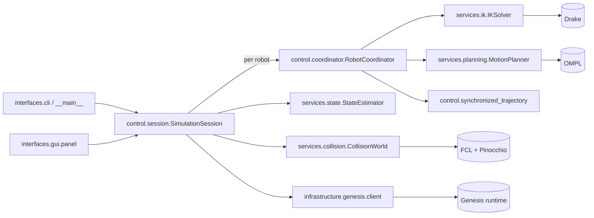
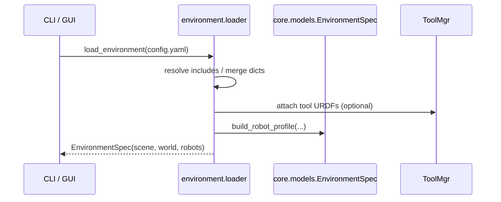
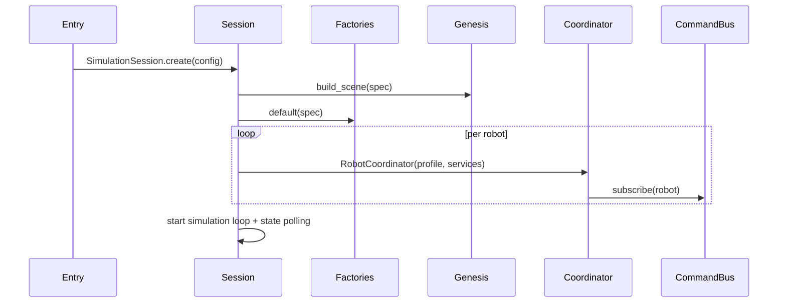
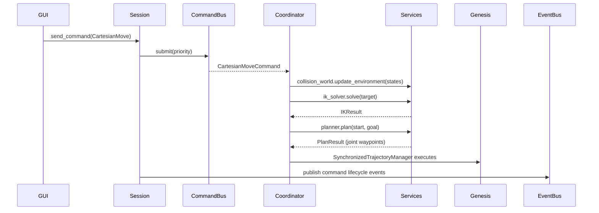

# Simforge Architecture

The `simforge_genesis` package hosts the modular runtime that powers the Simforge robotics stack. It keeps the outward-facing package name simply “Simforge” while reusing select legacy modules (IK, collision, tooling) from the original `simforge` namespace where they remain battle-tested. This document captures the current layering, entry points, and extension seams so contributors can reason about the system without juggling multiple versions.

---

## 1. High-level view

Simforge relies on Genesis for physics/rendering, Drake for IK, OMPL for planning, and FCL + Pinocchio for collision geometry. Those dependencies are wrapped behind services so the controller can run headless or through the wxPython GUI.

### Package layout cheat-sheet

| Package | Responsibility |
|---------|----------------|
| `core` | Shared data models, command/event definitions, Pydantic config schema, enums. |
| `environment` | YAML loader (`loader.py`) that resolves includes, attaches tools, and materialises `EnvironmentSpec`. |
| `interfaces` | CLI/GUI front-ends; CLI drives headless sessions, GUI embeds the controller in a thread. |
| `control` | Session orchestration, command/event buses, per-robot coordinators, synchronised trajectory manager. |
| `services` | Abstract service layer (IK, planning, collision, state estimation) plus concrete implementations (Drake, OMPL, FCL, polling). |
| `infrastructure` | Genesis adapters: client lifecycle, scene builders, DOF IO helpers. |
| `logging` | Colored logging helpers used by CLI/GUI/tests. |
| `demo` & `tests` | Packaged demos and regression tests for the stack. |

---

## 2. Configuration and environment assembly

1. The CLI/GUI calls `environment.load_environment(path)`.
2. `EnvironmentConfig` (Pydantic model) is validated after includes are merged.
3. `ToolManager` optionally fuses robot/tool URDFs before computing `RobotProfile` objects.
4. The loader resolves world objects (planes, boxes, spheres, external URDFs) and emits an `EnvironmentSpec` consumed by the session and services.

Key data structures:

- `core.config_schema.EnvironmentConfig` – user-authored config, immutable after validation.
- `core.models.RobotProfile` – runtime description (URDF path, mount pose, policies, metadata).
- `core.models.EnvironmentSpec` – snapshot shared by the session, services, and GUI.

---

## 3. Runtime orchestration (control layer)

`SimulationSession` is the entry point used by the CLI, GUI, demos, and tests.

### Session bootstrap

1. `SimulationSession.create()` loads an `EnvironmentSpec` and instantiates a `GenesisClient`.
2. `infrastructure.genesis.builders.build_scene()` adds robots and world collision objects to Genesis and returns entity handles.
3. The session initialises:
   - `EventBus` for telemetry (`core.events`).
   - `CommandBus` for prioritized per-robot queues.
   - Service factories (`ServiceFactories.default`) that lazily construct IK, planner, collision, and state services.
   - A `RobotCoordinator` per robot, sharing a `SynchronizedTrajectoryManager` for multi-robot timing.

### Command lifecycle

Highlights:

- `CommandBus` emits `CommandAccepted` / `CommandRejected` events.
- `RobotCoordinator` enforces queueing policy (`append` vs `interrupt`) and hosts the planner/IK loop.
- `SynchronizedTrajectoryManager` keeps multiple trajectories time-aligned, enabling bimanual or robot-tool motions.
- `SimulationSession` tracks latest `RobotState` samples (from the `StateEstimator`) for GUI queries and collision updates.

---

## 4. Service layer

Each service exposes a small protocol in `simforge_genesis/services/*/base.py`.

| Service | Protocol | Default implementation | Notes |
|---------|----------|------------------------|-------|
| Inverse Kinematics | `IKSolver.solve(IKRequest) -> IKResult` | `DrakeIKSolver` | Wraps Drake plant + caches. Supports Cartesian and joint seeds, optional collision callbacks. |
| Motion Planning | `MotionPlanner.plan(PlanRequest) -> PlanResult` | `OMPLMotionPlanner` | Configurable by planner strategy (joint vs Cartesian preference) and reuses `CollisionWorld` to validate waypoints. |
| Collision | `CollisionWorld.is_state_valid(CollisionQuery) -> CollisionCheck` | `FCLCollisionWorld` (fallback: `SimpleCollisionWorld`) | Uses the legacy FCL bindings, maintains Pinocchio models, updates per-robot environments, and enforces minimum clearance. |
| State estimation | `StateEstimator.states(subscription)` | `PollingStateEstimator` | Polls Genesis DOFs, emits `RobotState` async stream, backs GUI sliders and collision env updates. |

Services are created through `ServiceFactories` so tests can inject doubles/mocks.

### Collision world details

- Loads URDF collision geometry through `simforge.collision_checker.CollisionChecker`.
- Shares Pinocchio state across robots so inter-robot clearance checks remain accurate.
- Mirrors world objects for FCL (boxes/spheres/plane) and registers additional meshes when requested.
- Tracks latest joint vectors for each robot and pushes them into other robots' checkers via `update_env_robot_from_pin` (falling back to the heuristic `SimpleCollisionWorld` if dependencies are unavailable).

### Legacy interoperability

- IK, collision, and tooling modules reuse the legacy `simforge` implementations to avoid duplicating native bindings.
- Ownership and cleanup stay in the legacy package; `simforge_genesis` only holds lightweight adapters (`DrakeIKSolver`, `FCLCollisionWorld`).
- When optional dependencies are missing, the adapters degrade gracefully (raising import errors early or falling back to the heuristic collision checker).

---

## 5. Genesis integration (infrastructure layer)

`simforge_genesis/infrastructure/genesis` encapsulates all direct interactions with Genesis:

- `client.py` – wraps the Genesis Python client, backend selection, and teardown.
- `builders.py` – creates scenes/robots/objects from an `EnvironmentSpec` and returns `SceneBuildResult` (scene handle + entity map).
- `io.py` – resilient getters/setters for joint DOFs (`get_joint_positions`, `set_joint_positions`) that coerce tensors, CPU/GPU arrays, and legacy APIs.
- `wrapper.py` – thin compatibility utilities for optional Genesis features.

By routing Genesis usage through this package the control layer remains testable without Genesis (tests can stub the infrastructure methods or use fake entities).

---

## 6. Interfaces

### CLI (`interfaces.cli`)

- `simforge_genesis init` copies preset configs for experimentation.
- `simforge_genesis run --config ...` launches the GUI (if wxPython is present) with logging and backend selection.
- `simforge_genesis demo` enumerates packaged demos (`demo/` folder) and runs them headless.

### GUI (`interfaces.gui.panel`)

- `SessionController` spins up a simulation session inside a dedicated asyncio loop/thread to keep the wx event loop responsive.
- Provides joint sliders, Cartesian targeting, and frame selection. Commands are dispatched via the session API and queue with `queue_mode="interrupt"` so manual operations pre-empt plans.
- Polls state via `SimulationSession.get_latest_state` and updates slider positions regularly.

---

## 7. Eventing, logging, and telemetry

- `control.event_bus.EventBus` is a lightweight async pub/sub hub. Events derive from `core.events.Event`. The session, coordinators, and GUI can subscribe for analytics, debugging, or remote control.
- Logging is standardised through `logging.setup_logging`, which configures colored console output, quiets verbose dependencies, and honours the `PoliciesConfig.logging` level.
- Future telemetry hooks (structured logs, remote streaming) hang off the event bus and can be switched on per policy without modifying the controller.

---

## 8. Extending the stack

- **Adding a service implementation**: implement the relevant protocol (`IKSolver`, `MotionPlanner`, etc.), then register it via custom `ServiceFactories`. Tests can inject fakes the same way.
- **Supporting a new robot**: extend the YAML preset, provide URDF + meshes, and (if needed) supply metadata for DOF counts or IK tolerances. The loader assembles a new `RobotProfile` automatically.
- **Introducing a new UI**: consume `SimulationSession` directly (headless) or reuse the `CommandBus/EventBus` contracts. The GUI already demonstrates running the session in another thread.
- **Alternative runtime**: mock `infrastructure.genesis` adapters in tests or integrate another simulator by porting the builder/client modules while reusing services.

Keep cross-layer dependencies flowing “downwards”: interfaces depend on `control`, `control` depends on `services` and `infrastructure`, and `services` depend on `core` + optional third parties. This boundary makes the stack easier to test, profile, and iterate.

---

### Appendix: glossary of important classes

| Symbol | Location | Purpose |
|--------|----------|---------|
| `SimulationSession` | `control.session` | Builds scenes, owns command/state buses, exposes public API for commands and state queries. |
| `RobotCoordinator` | `control.coordinator` | Per-robot command processor with IK, planning, collision checks, and trajectory execution. |
| `ServiceFactories` | `control.session` | Lazily initialises shared service instances (IK, planner, state estimator, collision world). |
| `CommandBus` | `control.command_bus` | Async priority queues with per-robot isolation. |
| `EventBus` | `control.event_bus` | Async pub/sub for controller lifecycle events. |
| `FCLCollisionWorld` | `services.collision.fcl_checker` | Geometry-aware collision backend with Pinocchio support and heuristic fallback. |
| `PollingStateEstimator` | `services.state.simple` | Polls Genesis entities at fixed frequency to provide fresh joint states. |
| `DrakeIKSolver` | `services.ik.drake_solver` | Builds and caches Drake Multibody plants per robot. |
| `OMPLMotionPlanner` | `services.planning.ompl_planner` | Runs joint/cartesian planners and filters candidates using `CollisionWorld`. |

This reference should give contributors a current mental model of the Simforge stack and how it composes legacy modules with the modern control runtime.
